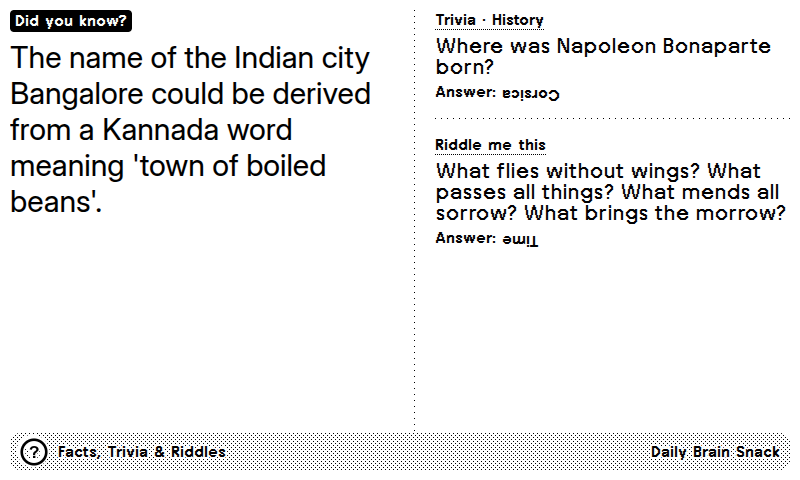
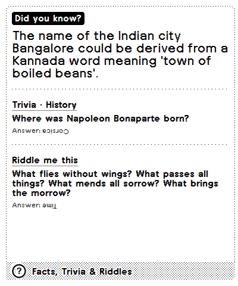

# Facts, Trivia & Riddles for TRMNL

A daily run plugin for your [TRMNL](https://usetrmnl.com) e-ink display: 

One "Did you know?"
fact, one trivia question and one riddle, fresh every day.



## What it shows

- **Fact**: a Wikipedia "Did you know?" hook most days, and an "On this day" anniversary for the
  current date about one day in six.
- **Trivia**: a question from the Open Trivia Database, with its category in the label.
- **Riddle**: a classic riddle.

Any section can be switched off, and you choose which one gets the large primary slot. Answers can
be shown upside down (the default), hidden until a time of your choosing, shown plainly, or never
shown.

Content is served from a daily feed built in this repository (see [How it works](#how-it-works)),
and every item is tracked so nothing repeats while unseen items remain.

## Layouts

All four TRMNL layouts are supported in landscape and portrait, on the original TRMNL and the
larger TRMNL X.

| Half horizontal | Half vertical | Quadrant |
|---|---|---|
|  |  |  |

## Install

### As a recipe

The recipe is not published in the TRMNL recipe directory yet. Once it is, installing it from
**Plugins → Recipes** is the easiest route and needs no setup.

### As a private plugin

Use this if you want to run your own copy or tweak the templates.

<details>
<summary>Using trmnlp (recommended)</summary>

1. Install [trmnlp](https://github.com/usetrmnl/trmnlp) (`gem install trmnl_preview`, or use
   the Docker wrapper in `bin/trmnlp`).
2. Clone this repository and log in: `trmnlp login`.
3. Remove the `id:` line from `src/settings.yml` so a new plugin is created for your account,
   then run `trmnlp push`.

The plugin polls `https://eds123.github.io/trmnl-facts-trivia-riddles/data.json`, the feed built
by this repository. To host your own feed, fork the repo, enable GitHub Pages on the `gh-pages`
branch (the workflow creates it on its first run) and point `polling_url` at your fork.

</details>

<details>
<summary>Manually in the TRMNL dashboard</summary>

1. **Plugins → Private Plugin → New**. Set the strategy to **Polling** and the polling URL to
   `https://eds123.github.io/trmnl-facts-trivia-riddles/data.json`.
2. In the form builder, paste the `custom_fields` block from `src/settings.yml`.
3. Open **Edit Markup** and paste each file from `src/` into the matching tab: `full.liquid`,
   `half_horizontal.liquid`, `half_vertical.liquid`, `quadrant.liquid` and `shared.liquid`.
4. Save, then add the plugin to a playlist.

</details>

## How it works

```
GitHub Actions (daily, 03:17 UTC)
  scripts/build_data.py
    ├─ picks a fact, trivia question and riddle for every date up to 45 days ahead
    ├─ records every pick in history.json so nothing repeats while unseen items remain
    └─ publishes data.json + history.json to the gh-pages branch
GitHub Pages serves data.json
TRMNL polls it and the templates pick the entry for the user's local date
```

The feed is a JSON object keyed by date, covering the past week and the next 45 days:

```json
{
  "days": {
    "2026-09-22": {
      "fact":   { "kind": "dyk", "text": "…", "url": "https://en.wikipedia.org/wiki/…" },
      "trivia": { "category": "History", "difficulty": "hard", "question": "…", "answer": "…", "choices": ["…"] },
      "riddle": { "question": "…", "answer": "…" }
    }
  }
}
```

Note: If the feed is unreachable the templates fall
back to a small built-in sample set.


## Development

```sh
bin/trmnlp serve        # live preview at http://localhost:4567 (polls the real feed)
bin/trmnlp build        # renders each layout into _build/
```

To preview a specific day, override the clock in `.trmnlp.yml` with a Unix timestamp:

```yaml
variables:
  trmnl:
    system:
      timestamp_utc: 1790067600   # 2026-09-22 09:00 UTC
```

To build the feed locally (writes to `public/`, stdlib only):

```sh
python3 scripts/build_data.py                 # extend the schedule from today
python3 scripts/build_data.py 2026-10-01      # pretend today is another date
python3 scripts/build_data.py --reschedule-from 2026-09-14   # re-pick future days after a rule change
```

The GitHub workflow can be run by hand from the Actions tab. Its optional `reschedule_from`
input does the same as the flag above.

The facts pool in `data/facts.json` was imported once with `scripts/import_facts.py`, which needs
`pyarrow` and a local copy of the Hugging Face dataset. It does not run in CI.

## Data sources

| Section | Source | Licence |
|---|---|---|
| Trivia | [Open Trivia Database](https://opentdb.com) | CC BY-SA 4.0 |
| Facts | Wikipedia "Did you know?" hooks via [derenrich/enwiki-did-you-know](https://huggingface.co/datasets/derenrich/enwiki-did-you-know), and [Wikipedia "On this day"](https://en.wikipedia.org/api/rest_v1/) via the Wikimedia REST API | CC BY-SA 4.0 |
| Riddles | [crawsome/riddles](https://github.com/crawsome/riddles) | Unlicense (public domain) |

See [SOURCES.md](SOURCES.md) for details on how each source is filtered and attributed. The
generated `data.json` is published under CC BY-SA 4.0.


## Licence

The templates and scripts are [MIT licensed](LICENSE). The content in `data/` and the generated
feed are licensed by their sources as listed above. Publishing the plugin as a TRMNL recipe also
places the markup under [CC BY 4.0](https://github.com/usetrmnl/plugin-license), as TRMNL
requires.
